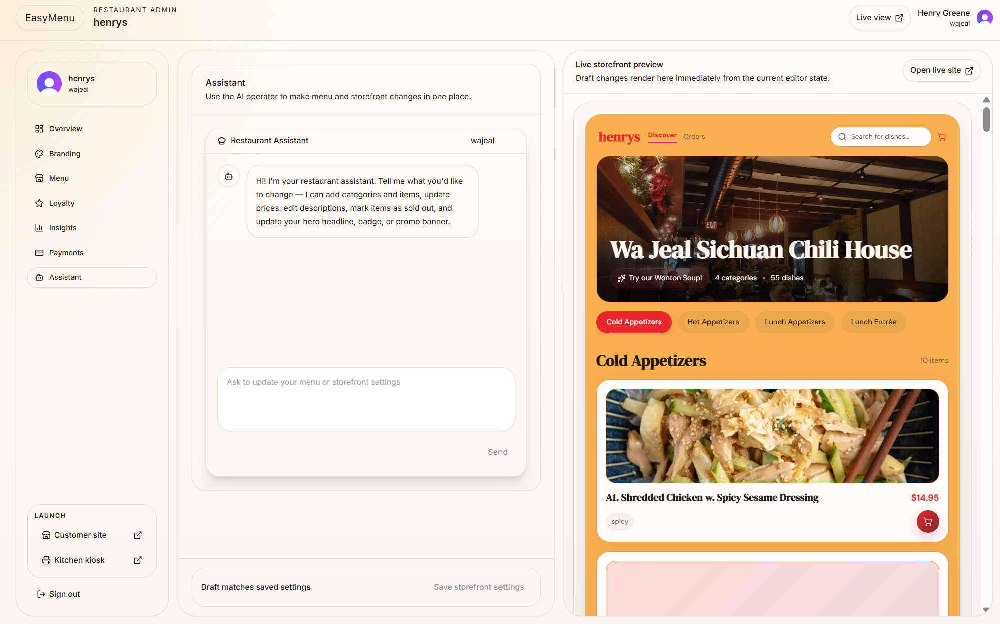

# EasyMenu

A multi-tenant restaurant ordering platform built as a
commission-free alternative to Grubhub and DoorDash.

**[Live Demo](https://easymenu.website)** | **[Live Pilot — Wa Jeal Sichuan](https://wajeal.easymenu.website/)**

## What It Does

Independent restaurants get their own branded storefront,
kitchen dashboard, and admin panel — with zero commission fees.
Currently piloting with a local restaurant handling real orders.

## Key Features

- Multi-tenant architecture — each restaurant gets isolated
  branded storefront via subdomain routing
- Full ordering flow — menu, cart, Stripe checkout,
  real-time order tracking
- Kitchen dashboard — live order queue with status transitions
- Admin panel — menu management, brand customization,
  AI assistant, analytics
- Loyalty/rewards system
- Stripe Connect — restaurants onboard and receive payments directly
- Twilio SMS — order notifications
- Postgres Row Level Security — tenant data isolation at DB level

## Tech Stack

- **Frontend:** React, Vite, TypeScript
- **Backend:** Node.js, Express, Prisma
- **Database:** PostgreSQL with Row Level Security
- **Payments:** Stripe Connect
- **Auth:** Clerk
- **Notifications:** Twilio SMS
- **Deployment:** Render (API), Vercel (frontend)
- **Storage:** Cloudflare R2

## Architecture

Monorepo with separate apps for storefront, admin,
kitchen dashboard, and API. Multi-tenancy resolved via
host header with Postgres RLS enforcing data isolation.

## Business Model

Flat monthly subscription — restaurants keep 100% of their revenue.
